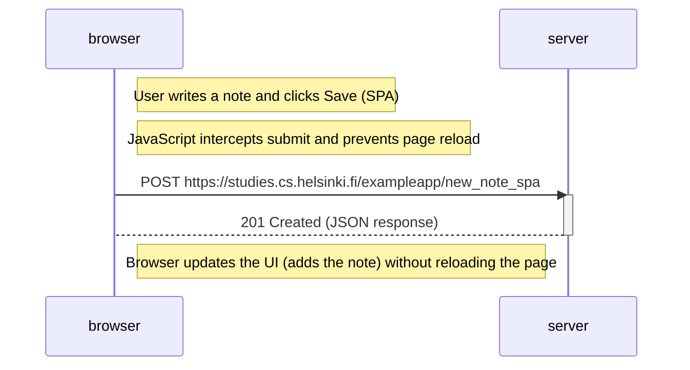

```mermaid
sequenceDiagram
    participant browser
    participant server

    Note right of browser: User writes a note and clicks Save (SPA)
    Note right of browser: JavaScript intercepts submit and prevents page reload

    browser->>server: POST https://studies.cs.helsinki.fi/exampleapp/new_note_spa
    activate server
    server-->browser: 201 Created (JSON response)
    deactivate server

    Note right of browser: Browser updates the UI (adds the note) without reloading the page
```